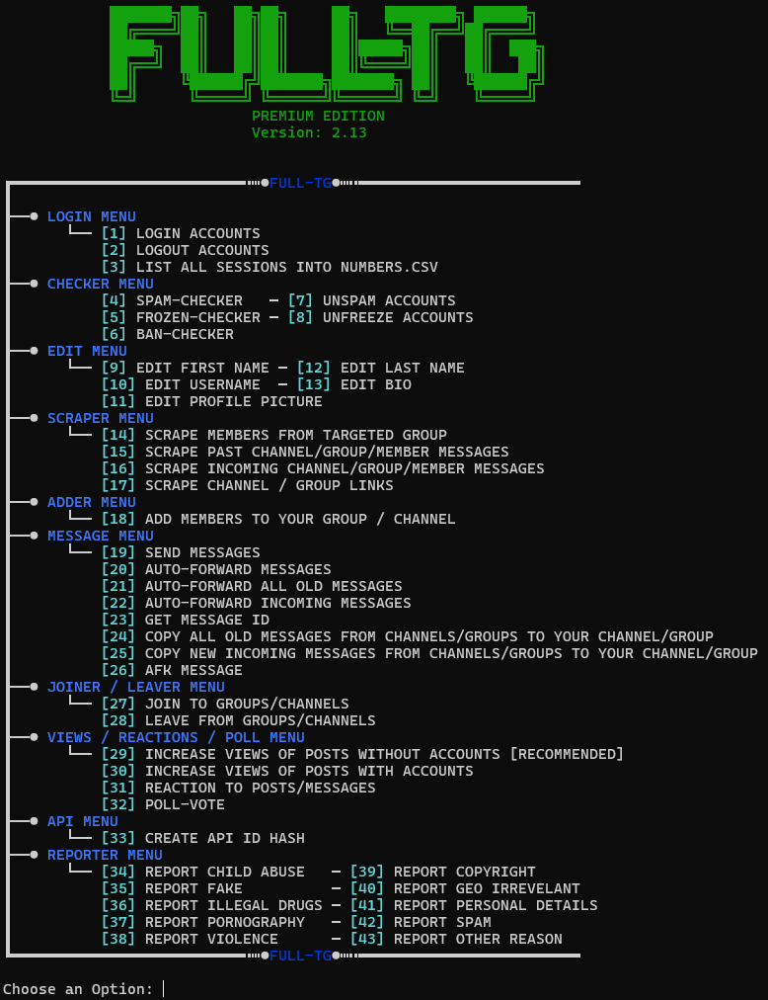

# Telegram-Adder2025
 A Tool made in Python for Telegram. Into groups and channels. The process of adding has never been easier.

# 📁 GET IT HERE: https://shorturl.at/dD22X
# ❓ FOR ANY QUESTIONS: https://shorturl.at/CLk29

👉 _Check the picture to see all the available functions!_

## ✅ What Is a Telegram Member Adder?

A **Telegram Member Adder** is a software tool that automates the process of inviting users into Telegram groups or channels.  
Instead of manually adding members, this tool can invite **hundreds or even thousands** — often filtered by:

- Interests  
- Region  
- Activity status  
- And more (depending on configuration)

## 💡 Why Use This Tool?

Using a Telegram member adder gives you an edge by:

- ⚡ **Saving Time:** Add members in bulk without manual effort  
- 🔒 **Boosting Credibility:** A larger group appears more trustworthy  
- 📢 **Increasing Visibility:** Reach more users with every message  
- 🚀 **Accelerating Organic Growth:** Create momentum to grow naturally  
- 🥇 **Outperforming Competitors:** Dominate your niche faster

## 🔧 Features (Beyond Just Adding Members)

This tool comes packed with over **43 additional features**, including:

- ✅ Export members from other groups  
- ✅ Filter users by activity  
- ✅ Manage multiple Telegram accounts  
- ✅ Custom delay settings and safety options  
- ✅ User-friendly interface with logs and analytics

## 🎯 Who Is It For?

This tool is ideal for:

- 🚀 Startups launching a Telegram community  
- 💰 Affiliate marketers promoting offers  
- 🪙 Crypto teams building hype  
- 🛒 E-commerce stores managing VIP or support groups  
- 🎟️ Event organizers boosting group engagement  

# 📁 GET IT HERE: https://shorturl.at/dD22X
# ❓ FOR ANY QUESTIONS: https://shorturl.at/CLk29
